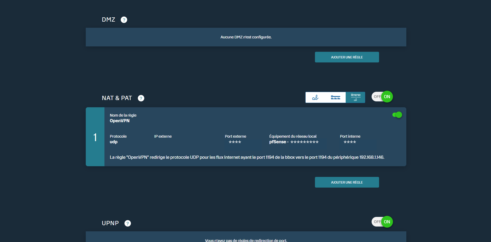
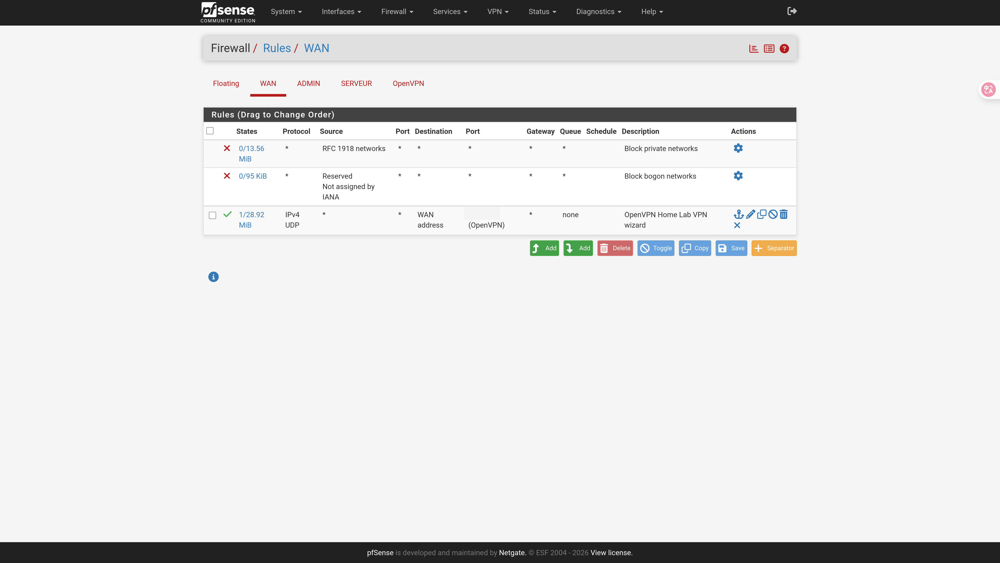
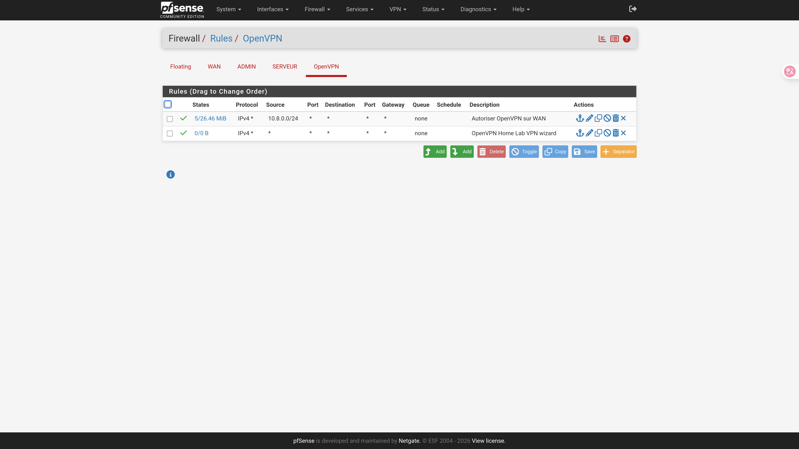
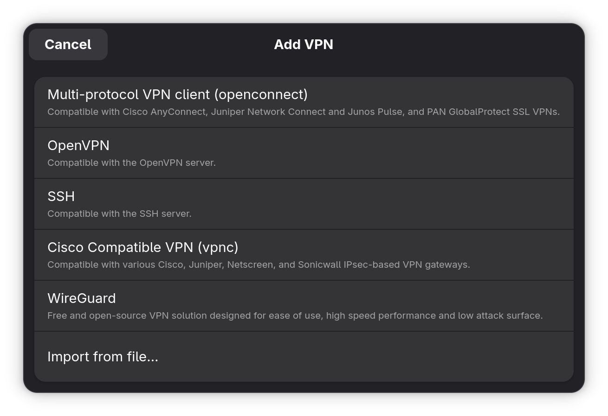
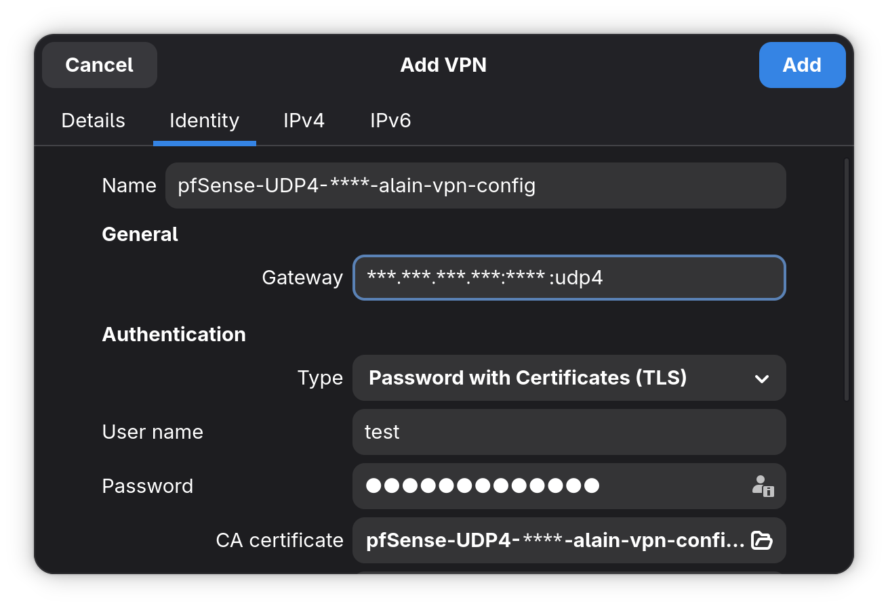
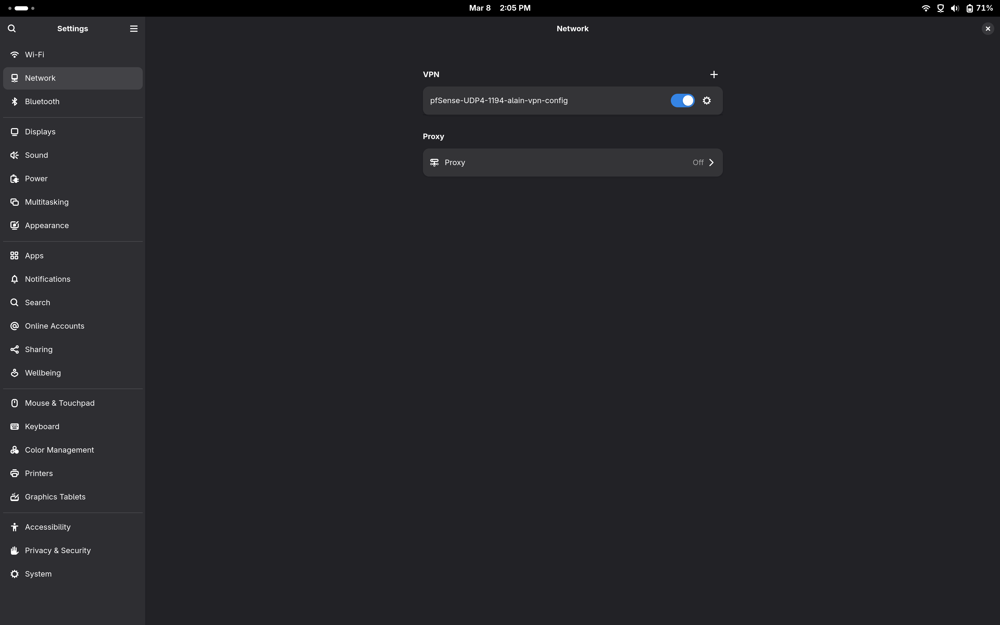
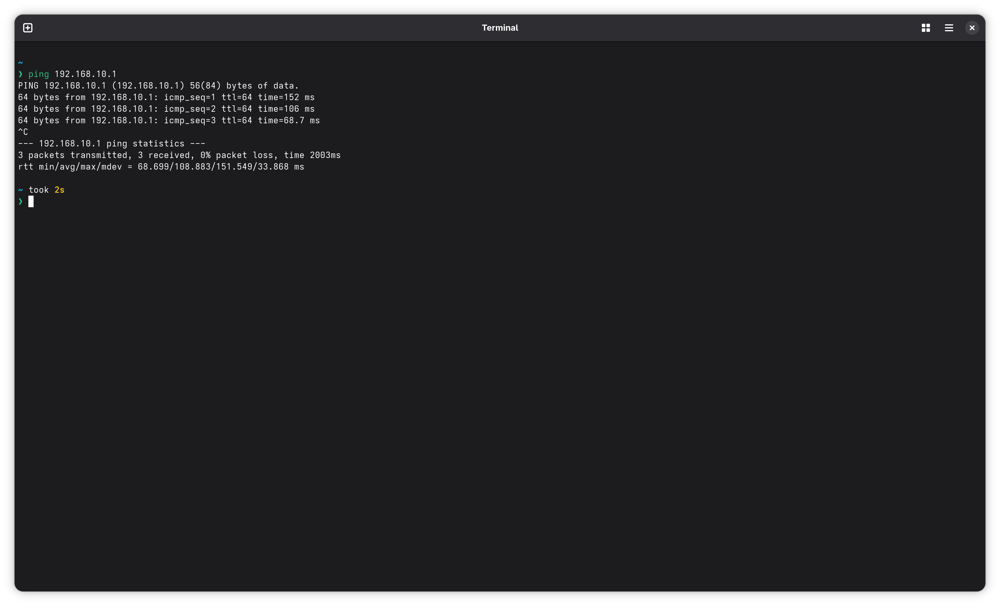

# Guide Complet : Configuration VPN Home Lab (pfSense)

Ce guide détaille la mise en place d'un accès distant sécurisé vers une infrastructure Home Lab segmentée par VLAN, utilisant **pfSense** comme passerelle VPN et **Fedora** comme client distant.

---

## Étape 1 : Création du Serveur VPN (Via le Wizard)
Utiliser l'assistant de configuration est la méthode la plus fiable pour générer les certificats nécessaires.

1. Dans pfSense, allez dans **VPN > OpenVPN > Servers**.
2. Cliquez sur le bouton **"Add"** pour lancer le Wizard.
3. **Type de serveur :** Choisissez **"Local User Access"**.
4. **Certificats :** Laissez le wizard créer une nouvelle CA (ex: *HomeLabCA*) et un nouveau certificat serveur (ex: *HomeLabVPNServer*).
5. **Configuration réseau :**
    * **Interface :** WAN.
    * **Port :** (ex: `1120 UDP`).
    * **Tunnel Network :** `10.8.0.0/24`.
    * **Local Network(s) :** `192.168.10.0/24, 192.168.11.0/24` (Séparez vos VLANs par une virgule).
6. **DNS :** Vous pouvez mettre l'IP de votre pfSense (`192.168.10.1`) et un DNS public (`8.8.8.8`).
7. Terminez le wizard. Il créera automatiquement les règles de firewall nécessaires sur les interfaces WAN et OpenVPN.

---

## Étape 2 : Création de l'utilisateur
Pour que votre client puisse s'authentifier, vous devez créer un compte utilisateur associé au serveur VPN.

1. Allez dans **System > User Manager**.
2. Cliquez sur **"+ Add"**.
3. **Username :** Choisissez un nom (ex: *john-vpn*).
4. **Password :** Définissez un mot de passe robuste.
5. **Certificate :** Cochez la case **"Click to create a user certificate"**.
6. **Descriptive Name :** Donnez un nom au certificat (ex: *Cert-John*).
7. Cliquez sur **Save**. L'utilisateur est désormais prêt à utiliser le tunnel.

---

## Étape 3 : Configuration NAT sur la Box Opérateur
L'objectif est de diriger tout le trafic VPN arrivant sur votre IP publique vers votre routeur pfSense.

1. Accédez à l'interface de gestion de votre box (ex: `192.168.1.254`).
2. Cherchez la section **NAT / PAT** ou **Redirection de ports**.
3. Créez une nouvelle règle :
    * **Protocole :** `UDP`
    * **Port externe/interne :** (ex: `1120`)
    * **Équipement cible :** IP de votre interface WAN pfSense.

### NAT & PAT de la Box

---

## Étape 4 : Ouverture du Pare-feu pfSense (WAN)
Assurez-vous que pfSense accepte les connexions entrantes sur son interface WAN.

1. Allez dans **Firewall > Rules > WAN**.
2. Vérifiez la présence de la règle (souvent créée par le Wizard OpenVPN) :
    * **Protocol :** `UDP`
    * **Port :** (ex: `1120`)
    * **Source :** `*`

### Firewall > Rules > WAN

---

## Étape 5 : Autorisation des flux internes (VLANs)
Pour que vos utilisateurs VPN puissent accéder à vos VLANs, il faut autoriser le trafic provenant du tunnel dans le pare-feu pfSense.

1. Allez dans **Firewall > Rules > OpenVPN**.
2. Assurez-vous que des règles "Pass" autorisent le trafic vers vos réseaux cibles.

### Firewall > Rules > OpenVPN

---

## Étape 6 : Exportation de la configuration client
1. Allez dans **VPN > OpenVPN > Client Export**.
2. Dans **Host Name Resolution**, sélectionnez "Other" et saisissez impérativement votre **IP publique**.
3. Téléchargez le fichier `.ovpn` (format "Inline Config").

---

## Étape 7 : Configuration sur Fedora (Client)
L'utilisation de *NetworkManager* permet une intégration native.

1. Allez dans **Paramètres > Réseau > VPN > Ajouter (+)**.
2. Cliquez sur **Importer depuis un fichier...** et sélectionnez votre `.ovpn`.
3. Dans l'onglet **IPv4**, vérifiez :
    * **Passerelle (Gateway) :** Votre IP publique (doit être différente de l'IP locale du pfSense).
    * **IP Locale :** Laisser vide (attribuée dynamiquement par le tunnel).

### configuration VPN sur Fedora

Faite **import from file..** et vous allez prendre votre fichier **.ovpn**

#### Après importation

Lorsque c'est fait vous allez changer les `*` par votre **adresse ip public** (ex: 176.143.189.70)

Dans **User name** vous rentrer le username rentré lors de la création de l'utilisateur vpn

Et dans **Password** vous rentrez le mot de passe que vous avez créé lors de la création du compte vpn

Dans **Name** vous devez remplacé les `*` par le ports que vous avez choisi

Dans **Gateway** vous devez remplacé au début les `*` par votre adresse ip plublic (ex: 176.143.189.70) et après le `:` vous devez remplacer les `*` par le port que vous avez choisi

#### Fini

Une fois que c'est fini, vous allez voir ceci:

---

## Étape 8 : Validation du test de connexion
Pour valider, testez impérativement depuis l'**extérieur** (partage de connexion 4G/5G).

1. Activez le VPN. L'icône dans la barre des tâches doit devenir active.
2. Tentez de pinger une ressource locale : `ping 192.168.10.1`.

### Ping réussi

---

### Aide au Diagnostic
* **Logs pfSense :** Consultez `Status > System Logs > OpenVPN`.
* **Logs Client (Fedora) :** Utilisez la commande `journalctl -u NetworkManager -f` dans un terminal pour voir le détail de l'échec de la poignée de main TLS (souvent dû à une mauvaise IP publique dans la Gateway).